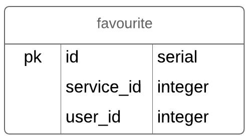

# Grow server side API
Below is the complete guide to help you get through grow api

## service

### service erd

### service endpoints

#### GET All Services
/api/v1/services {response is a json array of service objects }
#### GET Single Service 
/api/v1/services/:id {response is single service object if available }
#### POST Service
/api/v1/services {response is single inserted service object }
#### PUT Single Service
/api/v1/services/:id {response is single upadated service object }
#### DELETE Single Service
/api/v1/services/:id {response is a confirmation object }

## user 

### user erd

#### GET All Users
/api/v1/users {response is a json array of user objects }
#### GET Single User
/api/v1/users/:id {response is single user object if available }
#### POST User
/api/v1/users {response is single inserted user object }
#### PUT Single User
/api/v1/users/:id {response is single upadated user object }
#### DELETE Single User
/api/v1/users/:id {response is a confirmation object }

## Favourite 

### favourite erd

#### GET All Favourites
/api/v1/favourites {response is a json array of favourite objects }
#### GET Single Favourite
/api/v1/favourites/:id {response is single favourite object if available }
#### POST Favourite
/api/v1/favourites {response is single inserted favourites object }
#### PUT Single Favourite
/api/v1/favourites/:id {response is single upadated favourite object }
#### DELETE Single Favourite
/api/v1/favourites/:id {response is a confirmation object }

## Feedback 

### feedback erd

#### GET All Feedback
/api/v1/feedbacks {response is a json array of feedbacks objects }
#### GET Single Feedback
/api/v1/feedbacks/:id {response is single feedback object if available }
#### POST Feedback
/api/v1/feedbacks {response is single inserted feedback object }
#### PUT Single Feedback
/api/v1/feedbacks/:id {response is single upadated feedback object }
#### DELETE Single Feedback
/api/v1/feedbacks/:id {response is a confirmation object }

